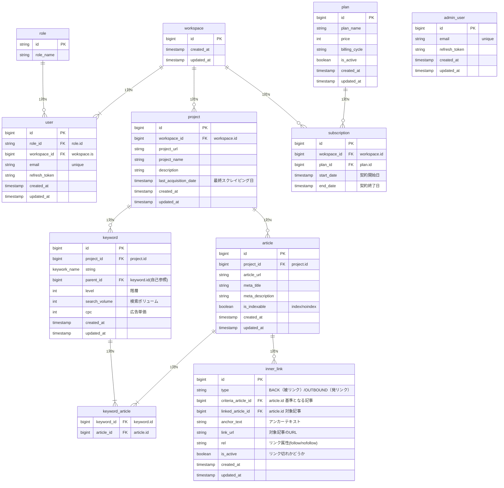

```mermaid
erDiagram
  workspace ||--|{ user : "1対N"
  workspace ||--o{ project : "1対N"
  workspace ||--o{ subscription : "1対N"
  plan ||--o{ subscription : "1対N"
  role ||--o{ user : "1対N"
  project ||--o{ keyword: "1対N"
  project ||--o{ article: "1対N"
  keyword ||--|{ keyword_article: "1対N"
  article ||--|{ keyword_article: "1対N"
  article ||--o{ inner_link: "1対N"

  %% 管理ユーザー情報
  admin_user {
    bigint id PK
    string email "unique"
    string refresh_token
    timestamp created_at
    timestamp updated_at
  }

  %% 権限
  role {
    string id PK
    string role_name
  }

  %% プラン
  plan {
    bigint id PK
    string plan_name
    int price
    string billing_cycle
    boolean is_active
    timestamp created_at
    timestamp updated_at
  }

  %% ワークスペース
  workspace {
    bigint id PK
    timestamp created_at
    timestamp updated_at
  }

  %% 契約情報
  subscription {
    bigint id PK
    bigint wokspace_id FK "workspace.id"
    bigint plan_id FK "plan.id"
    timestamp start_date "契約開始日"
    timestamp end_date "契約終了日"
  }

  %% ユーザー情報
  user {
    bigint id PK
    string role_id FK "role.id"
    bigint workspace_id FK "wokspace.is"
    string email "unique"
    string refresh_token
    timestamp created_at
    timestamp updated_at
  }

  %% プロジェクト情報
  project {
    bigint id PK
    bigint workspace_id FK "workspace.id"
    stirng project_url
    string project_name
    string description
    timestamp last_acquisition_date "最終スクレイピング日"
    timestamp created_at
    timestamp updated_at
  }

  %% キーワード
  keyword {
    bigint id PK
    bigint project_id FK "project.id"
    keywork_name string
    bigint parent_id FK "keyword.id(自己参照)"
    int level "階層"
    int search_volume "検索ボリューム"
    int cpc "広告単価"
    timestamp created_at
    timestamp updated_at
  }

  %% 記事（コンテンツ）
  article {
    bigint id PK
    bigint project_id FK "project.id"
    string article_url
    string meta_title
    string meta_description
    boolean is_indexable "index/noindex"
    timestamp created_at
    timestamp updated_at
  }

  %% キーワードとarticleのN：Nの関係を管理
  keyword_article {
    bigint keyword_id FK "keyword.id"
    bigint article_id FK "article.id"
  }

  %% 内部リンク（発リンク・被リンク）
  inner_link {
    bigint id PK
    string type "BACK（被リンク）/OUTBOUND（発リンク）"
    bigint criteria_article_id FK "article.id 基準となる記事"
    bigint linked_article_id FK "article.id 対象記事"
    string anchor_text "アンカーテキスト"
    string link_url "対象記事のURL"
    string rel "リンク属性(follow/nofollow)"
    boolean is_active "リンク切れかどうか"
    timestamp created_at
    timestamp updated_at
  }
```
